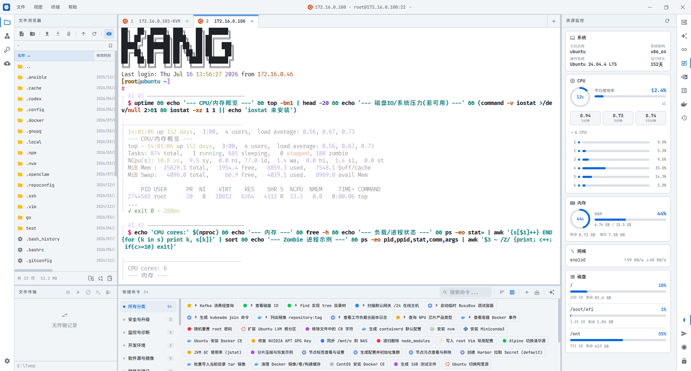
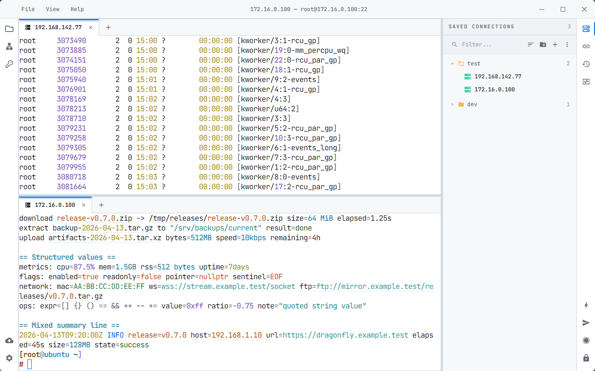
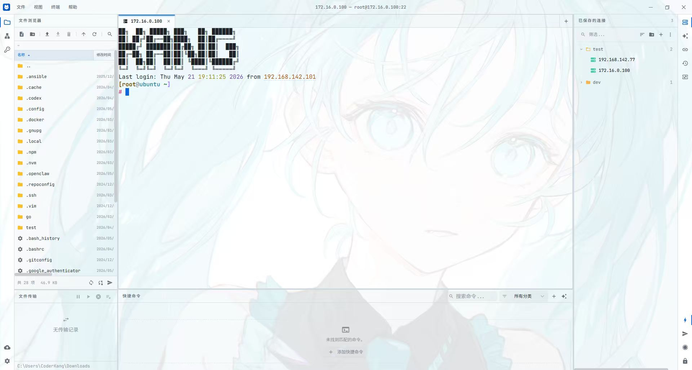
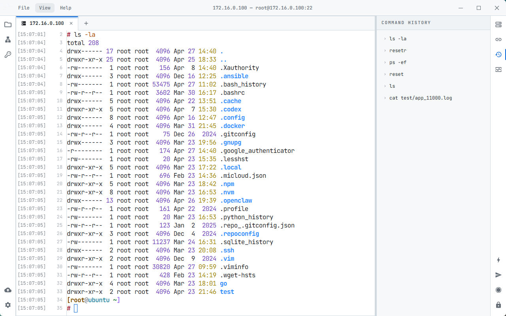
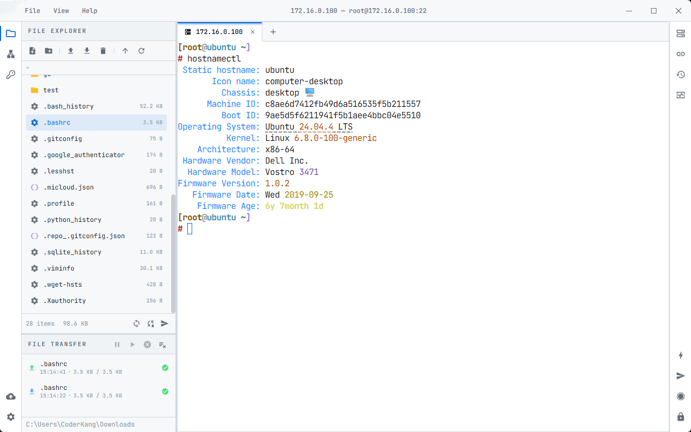
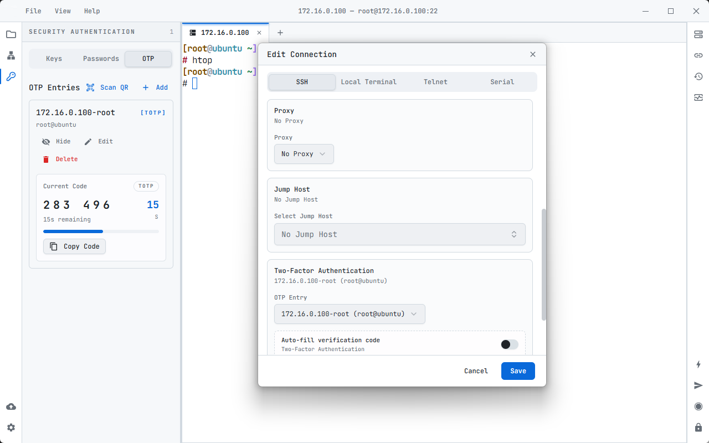
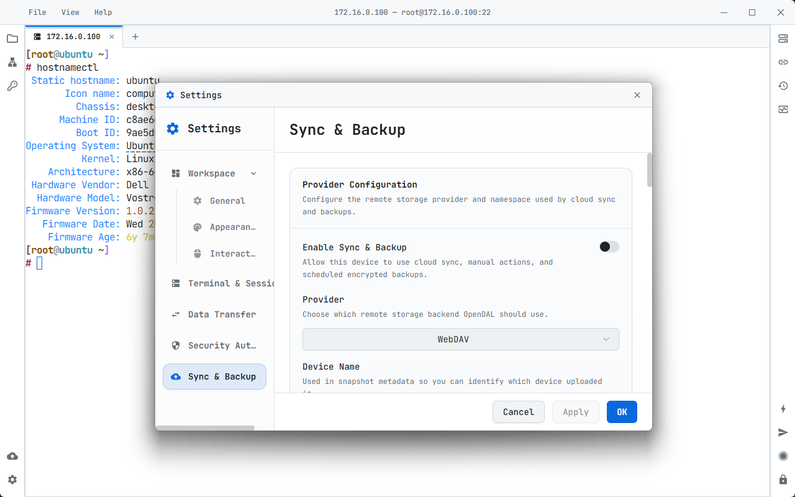

<p align="center">
  
</p>

<h1 align="center">NiceTerm</h1>

<p align="center">
  <strong>基于 Tauri、React 与 Rust 构建的现代远程终端工作区。</strong><br/>
  <a href="https://gitee.com/xenchin/NiceTerm"><strong>Gitee 仓库</strong></a>
</p>

<p align="center">
  在一个桌面客户端中处理 SSH、本地 Shell、Telnet、串口、RDP、VNC、SFTP、隧道、OTP、AI 辅助与加密同步。
</p>

> **分支说明** — NiceTerm 是 [NyaTerm](https://github.com/nyakang/nyaterm)（作者
> [NyaKang](https://github.com/nyakang)）的分支项目。原项目采用 MIT 开源协议，本分支保持协议不变，
> 并向原作者致谢。原项目的发布版本、文档与社区频道（Discord / 微信群）请访问
> [原仓库](https://github.com/nyakang/nyaterm)。

<p align="center">
  
  &nbsp;
  <a href="LICENSE">
    
  </a>
</p>
<p align="center">
  <a href="./README.md">English</a> · <a href="./README.zh-CN.md">简体中文</a>
</p>

---

<p align="center">
  <picture>
    <source media="(prefers-color-scheme: dark)" srcset="./docs-site/static/img/home/product-dark.png">
    <source media="(prefers-color-scheme: light)" srcset="./docs-site/static/img/home/product-light.png">
    
  </picture>
</p>

---

<a name="ai-assistant"></a>
# AI Assistant

NiceTerm 内置 AI Assistant 面板，可用于生成命令、解释终端输出、分析错误，以及在终端上下文中执行多步辅助操作。

## 它能做什么

- **Ask 模式**：适合单次问答，例如生成命令、解释选中输出、分析错误
- **Agent 模式**：基于当前活跃终端会话，按“观察、决策、执行”的循环完成多步任务
- **最近输出入口**：可以直接让 AI 解释最近的终端输出，不必手动复制
- **结构化命令卡片**：展示风险等级、执行控制，并可保存为快捷命令
- **已审批命令执行工具**：Agent 工作流可在审批后执行命令，并在终端任务结束后给出独立最终回答
- **终端内联输出捕获**：Agent 执行命令时可把输出写回终端，并通过 `Terminal Output Lines` 控制显示行数
- **会话提及**：输入 `@` 可把其他终端会话纳入当前 AI 上下文
- **Provider 管理**：支持内置 provider、手动模型、凭据分组和自定义 OpenAI Compatible 端点
- **风险控制**：对高影响命令提供审批门槛和更安全的替代建议


---

<a name="niceterm-是什么"></a>
# NiceTerm 是什么

**NiceTerm** 是一个面向 SSH 运维和混合终端工作流的桌面客户端。它使用 React + Tauri 构建界面，由 Rust 后端负责 SSH、SFTP、会话生命周期、认证、网络工具、AI 辅助终端操作、导入导出、诊断、加密同步与备份。

- **NiceTerm 是** 面向开发者、系统管理员和 DevOps 工程师的 SSH 客户端
- **NiceTerm 是** 支持标签页、横向分屏和纵向分屏的终端工作区
- **NiceTerm 是** 带传输队列和“本地编辑后回传”流程的 SFTP 文件浏览器
- **NiceTerm 支持** SSH、本地终端、Telnet、串口、RDP 和 VNC 会话
- **NiceTerm 不是** Shell 替代品；它用于连接远程 Shell、本地 Shell、Telnet 端点和串口设备

---

<a name="为什么选择-niceterm"></a>
# 为什么选择 NiceTerm

NiceTerm 适合每天在服务器、本地命令、设备调试和配置文件之间来回切换的工作方式。

- **工作区优先**：用标签页、分屏、侧边面板和子窗口组织相关任务
- **远程操作不脱离上下文**：在会话旁浏览 SFTP 文件、跟随终端路径、管理传输、编辑远程文件
- **面向安全的工作流**：管理凭据、私钥、known hosts、OTP、锁屏和主密码保护的本地存储
- **可迁移配置**：从已有工具导入会话，导出加密 `.nya` 备份，并通过 WebDAV 或 S3 兼容存储同步加密快照
- **恰到好处的 AI**：从当前终端上下文生成命令、检查输出，并在审批后执行多步操作

---

<a name="功能特性"></a>
# 功能特性

## 会话与工作区

- 支持 SSH、本地终端、Telnet、串口、RDP 和 VNC 会话
- 多标签页工作区，标签页内支持横向/纵向分屏、标签拖拽停靠和布局恢复
- RDP 与 VNC 远程桌面 pane；VNC 当前支持 direct TCP、None / classic VNC Auth、Raw / ZRLE / Tight / Tight JPEG framebuffer 更新、窗口缩放、有界重连，以及 Latin-1 文本剪贴板交换
- 已保存连接支持分组、图标、元数据、复制、键盘复制、重连和导入
- 命令面板与会话快速切换器，可查找应用动作、已打开会话、已保存连接和新建会话入口
- 主窗口支持 `Background Image` 背景图自定义，可调 `cover` / `contain` / `stretch` / `tile` 以及 `Background Content Opacity`
- 左右活动栏覆盖文件浏览器、网络、Security/Auth、Sync & Backup、AI Assistant、Notes、已保存连接、活动会话、命令历史、资产监控和资源监控
- Notes 面板和编辑器支持树形导航、右键菜单、自动保存、工具栏控制，以及可参与同步 / 备份的持久化
- 资产监控工作区支持连接分组视图、面包屑导航、表格 / 卡片布局，并集成资源、GPU 与 NPU 状态
- SSH 会话远程主机监控面板覆盖资源监控、NVIDIA / Ascend GPU 与 NPU 总览、进程管理和 Docker 管理
- 设置、新建连接、快捷命令编辑、远程文件编辑和自动上传提示使用独立子窗口
- 支持托盘、关闭时最小化到托盘和隐藏主窗口

## 终端体验

- 终端搜索支持结果跳转和搜索历史，另有复制粘贴、右键菜单和选中文本操作
- 命令历史、模糊建议、用于过滤噪音命令的长度配置，以及交互式程序中的建议抑制
- 可选行号和时间戳 gutter
- 可选动作链接，识别 IPv4、`host:port` 和压缩包文件名
- 可选关键词高亮，支持内置预设、自定义规则和 JSON 导入
- 支持终端缩放、工作区 padding、字体粗细、macOS IME 兼容和图片路径粘贴
- 可直接让 AI 解释最近输出，并通过 `Terminal Output Lines` 控制 Agent 命令的终端内联输出
- 大输出保护、可配置回滚缓冲区、SSH Keep-Alive 和会话录制
- 可从选中文本发起在线搜索和翻译
- 支持直接在终端中使用 Zmodem 进行文件传输
- 支持自定义终端与界面操作的键盘快捷键，Telnet / 串口会话还支持 `Backspace Mode`

## SFTP 与文件工作流

- SSH 会话内置 SFTP 文件浏览器
- 支持上传、下载、重命名、移动、删除、属性、新建文件/文件夹和 OpenSSH 兼容符号链接
- 支持文件夹上传 / 下载、多目录上传选择、多选、可编辑路径栏，以及与终端 cwd 手动/自动同步
- 传输队列支持速度显示、暂停、继续、取消、失败重试、重复目标处理、时间戳保留和并发配置
- 增强 SCP 和目录传输处理，并在可用时保留原始属性
- 可在本地编辑远程文件，保存后通过 watcher 驱动的自动上传流程回传
- Windows 下支持从系统文件管理器拖拽文件或文件夹到文件浏览器上传
- Zmodem 传输会记录本地路径，并可在系统文件管理器中显示已完成文件

## 安全、认证与网络

- 密码认证、私钥、主机密钥校验和本地加密持久化
- 凭据管理支持基于正则的终端自动填充
- OTP 管理支持 TOTP/HOTP、二维码导入和 SSH 自动填充
- 支持 SOCKS5、HTTP 和 ProxyCommand 代理配置；支持带环路阻止的 SSH 跳板机；支持本地/远程/动态隧道
- 支持 SSH X11 转发，可配合本地 X server 使用
- 支持锁屏、空闲应用锁定、主密码、诊断设置、本地日志管理和诊断包导出

## 同步、备份与迁移

- 通过 WebDAV、S3 兼容存储和 GitHub Gist 进行加密云同步与备份
- 启用同步、备份、加密导入导出或定时加密备份前必须设置主密码
- 支持启动同步检查、本地变更后的防抖自动推送、详细状态更新和定时备份保留策略
- 支持手动测试、推送、拉取、备份、远程备份恢复和快照级冲突处理
- 支持从 Xshell、MobaXterm、WindTerm 和 NiceTerm JSON 定义导入会话
- 支持完整 NiceTerm 配置的加密 `.nya` 导入导出

---

<a name="截图"></a>
# 截图

## 工作区

在同一个标签页和分屏工作区中管理 SSH、本地 Shell、Telnet 和串口会话。

<p align="center">
  <picture>
    <source media="(prefers-color-scheme: dark)" srcset="./docs-site/static/img/home/overview-dark.png">
    <source media="(prefers-color-scheme: light)" srcset="./docs-site/static/img/home/overview-light.png">
    
  </picture>
</p>

## 外观与背景图

为主窗口设置本地壁纸，并通过 `Image Sizing`、`Image Opacity` 和 `Background Content Opacity` 平衡视觉效果与面板可读性。

<p align="center">
  <picture>
    <source media="(prefers-color-scheme: dark)" srcset="./docs-site/static/img/home/cover-dark.png">
    <source media="(prefers-color-scheme: light)" srcset="./docs-site/static/img/home/cover-light.png">
    
  </picture>
</p>

## 终端增强

在终端中使用命令历史、搜索、翻译、动作链接、时间戳、关键词高亮和大输出保护。

<p align="center">
  <picture>
    <source media="(prefers-color-scheme: dark)" srcset="./docs-site/static/img/home/terminal-dark.png">
    <source media="(prefers-color-scheme: light)" srcset="./docs-site/static/img/home/terminal-light.png">
    
  </picture>
</p>

## 远程文件

在终端旁浏览 SFTP 文件、管理传输队列，并把本地编辑器保存的修改回传到远端路径。

<p align="center">
  <picture>
    <source media="(prefers-color-scheme: dark)" srcset="./docs-site/static/img/home/files-dark.png">
    <source media="(prefers-color-scheme: light)" srcset="./docs-site/static/img/home/files-light.png">
    
  </picture>
</p>

## 安全与网络工具

在专用面板中管理凭据、OTP、known hosts、代理、跳板机和 SSH 隧道。

<p align="center">
  <picture>
    <source media="(prefers-color-scheme: dark)" srcset="./docs-site/static/img/home/security-dark.png">
    <source media="(prefers-color-scheme: light)" srcset="./docs-site/static/img/home/security-light.png">
    
  </picture>
</p>

## 同步与备份

通过 WebDAV 或 S3 兼容存储同步加密的可移植配置快照，并按需恢复远程备份。

<p align="center">
  <picture>
    <source media="(prefers-color-scheme: dark)" srcset="./docs-site/static/img/home/sync-dark.png">
    <source media="(prefers-color-scheme: light)" srcset="./docs-site/static/img/home/sync-light.png">
    
  </picture>
</p>

---

<a name="支持平台"></a>
# 支持平台

| 系统 | 支持情况 |
| :--- | :--- |
| **Windows** | Windows 10/11，x64 / arm64 |
| **macOS** | macOS 12+，Intel / Apple Silicon |
| **Linux** | Ubuntu 20.04+、Fedora 36+、Arch Linux 及类似发行版 |

可从 [Gitee Releases](https://gitee.com/xenchin/NiceTerm/releases) 页面下载安装包。原项目安装包见 [nyakang/nyaterm releases](https://github.com/nyakang/nyaterm/releases)。

---

<a name="支持的会话类型"></a>
# 支持的会话类型

| 类型 | 典型场景 | 说明 |
|------|----------|------|
| SSH | Linux / Unix 远程服务器 | 支持 SFTP、OTP、资源监控、代理、跳板机和隧道 |
| 本地终端 | 本地 Shell 工作流 | 使用本机 Shell 路径和工作目录 |
| Telnet | 旧设备或实验环境 | 轻量终端会话，不包含 SSH 专属能力，并支持 `Backspace Mode` 在 `Ctrl+H (BS)` 与 `DEL (0x7F)` 间切换 |
| 串口 | 路由器、开发板、嵌入式设备 | 可配置端口、波特率、数据位、校验位、停止位和 `Backspace Mode` |

---

<a name="快速开始"></a>
# 快速开始

## 下载

从 [Gitee Releases](https://gitee.com/xenchin/NiceTerm/releases) 下载适合你平台的最新版，或使用原项目 [nyakang/nyaterm releases](https://github.com/nyakang/nyaterm/releases)。

| 平台 | 格式 |
|------|------|
| Windows | `.msi` / `.exe` / 便携版 `.zip` |
| macOS | `.dmg` |
| Linux | `.deb` / `.AppImage` |

Windows 便携版解压后运行 `NiceTerm.exe` 即可。重启时 NiceTerm 会自动替换程序文件，并完整保留 `data/` 目录。

### macOS / Linux

从 [Gitee Releases](https://gitee.com/xenchin/NiceTerm/releases) 下载 `.dmg` / `.deb` / `.AppImage` 安装包后按常规方式安装。（原项目另提供 Homebrew 与 AUR 安装渠道，详见 [原项目仓库](https://github.com/nyakang/nyaterm)。）

NiceTerm 目前还没有使用 Apple Developer 证书签名。安装后如果 macOS 提示应用已损坏或无法打开，可以移除 quarantine 属性后再打开：

```bash
sudo xattr -cr /Applications/NiceTerm.app
```


## 开发环境要求

- Node.js 18+
- 通过 [rustup](https://rustup.rs/) 安装 Rust stable
- pnpm

## 本地开发

```bash
git clone git@gitee.com:xenchin/NiceTerm.git
cd NiceTerm
pnpm install
pnpm tauri dev
```

## 项目结构

```text
├── src/                    # React 前端
│   ├── components/         # UI、终端、面板、对话框、设置页
│   ├── hooks/              # 前端状态与工作流 hooks
│   ├── lib/                # 终端、AI、同步、主题、平台辅助逻辑
│   ├── pages/              # 子窗口页面
│   └── i18n/               # 应用内多语言
├── src-tauri/              # Tauri 2 + Rust 后端
│   ├── src/cmd/            # 暴露给前端的 Tauri commands
│   ├── src/core/           # SSH、SFTP、PTY、Telnet、串口、AI、备份逻辑
│   ├── src/config/         # 持久化配置模型
│   └── crates/otp/         # 本地 OTP 实现
├── docs-site/              # Docusaurus 文档站点
├── public/                 # 静态资源
└── scripts/                # 检查、版本同步与演示辅助脚本
```

---

<a name="鸣谢"></a>
# 鸣谢
感谢以下项目和库使 NiceTerm 成为可能：
- [WindTerm](https://github.com/kingToolbox/WindTerm) - 启发了 NiceTerm 的设计和功能
- [tabby](https://github.com/Eugeny/tabby) - 一个优秀的跨平台终端，提供了很多设计灵感
- [xterm.js](https://xtermjs.org/) - 强大的前端终端模拟器，提供了丰富的终端功能和扩展性
- [russh](https://github.com/warp-tech/russh) - SSH 客户端和服务端 Rust 库

---

<a name="赞助"></a>
# 致谢与原项目

NiceTerm 源自 [NyaTerm](https://github.com/nyakang/nyaterm)（作者 [NyaKang](https://github.com/nyakang)），
感谢原作者及所有上游贡献者的工作。原项目的贡献者列表与星标历史可在
[原仓库](https://github.com/nyakang/nyaterm) 查看。如需赞助原项目，请访问原仓库的赞助页面。

---

<a name="许可证"></a>
# 许可证

本项目基于 [MIT License](LICENSE) 开源（与原项目一致）。
